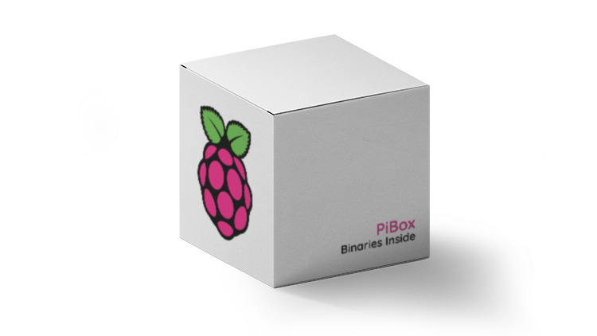

# PiBox

# About
  PiBox is a Docker-Compose file consiting of all the relevant components to setup your own Smart Home Server.

## Includes
* Traefik - Reverse Proxy for all services
* Caddy - Webserver for hosting Element files
* Watchtower - Pull Container images autoamtically
* Portainer - Container management UI
* HomeAssistant - Open source home automation suite
* Homebridge - iOS HomeKit API emulator
* TV Headend - Linux TV Streamer.

Avahi service files to allow mDNS for HomeAssistant & Homebridge containers without the need for "host" mode.

## Requirements
* Docker
* Docker-Compose

## Instructions 
* Clone Repo to ~/docker
* Move avahi service files to /
* Modify .env file
* Modify compose file.
* Change to PiBox directory
* docker-compose up -d docker-compose.yml
